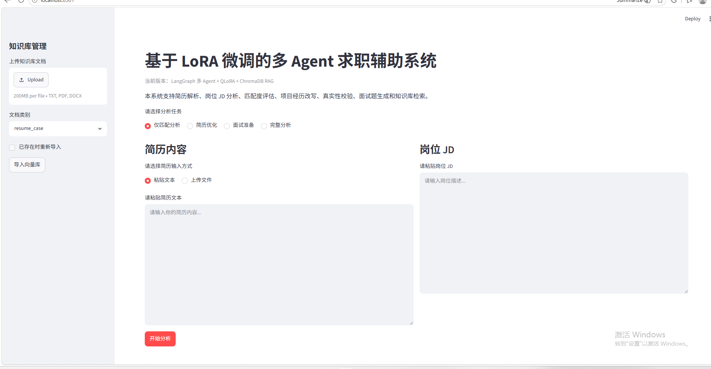
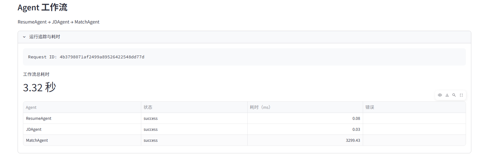
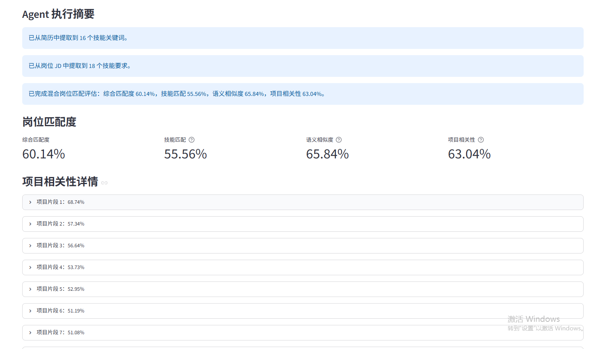

# 基于 LangGraph 与 QLoRA 的多 Agent 求职分析系统

一个面向简历优化与面试准备场景的多 Agent 大模型应用。系统基于 LangGraph 编排多个专业 Agent，结合 RAG、ChromaDB、bge-m3 和 QLoRA 微调模型，实现简历解析、岗位 JD 分析、匹配度评估、项目经历改写、内容校验、面试题生成和分析报告导出。

## 项目简介

用户输入简历和岗位 JD 后，系统会根据所选任务动态执行不同的 Agent 工作流：

* 仅匹配分析
* 简历优化
* 面试准备
* 完整分析

系统支持 TXT、PDF、DOCX 简历文件上传，并通过 FastAPI 提供后端接口、Streamlit 提供交互式前端。

## 核心功能

* 简历文本解析与技能提取
* 岗位 JD 技能要求分析
* 简历与岗位匹配度评估
* RAG 求职知识库检索
* 基于 QLoRA 模型的项目经历改写
* 生成内容真实性与风险校验
* 岗位相关面试题和回答建议生成
* Markdown 分析报告导出
* 知识库文档动态上传与去重
* Agent 调用链运行状态与耗时监控

## 系统架构

```text
用户输入简历与岗位 JD
        │
        ▼
   ResumeAgent
        │
        ▼
     JDAgent
        │
        ▼
    MatchAgent
        │
        ▼
  LangGraph 条件路由
   ├── 仅匹配分析 ───────────────→ END
   ├── 简历优化 → RAGAgent → RewriteAgent → ReviewAgent → END
   ├── 面试准备 → RAGAgent → InterviewAgent → END
   └── 完整分析 → RAGAgent → RewriteAgent → ReviewAgent
                                      │
                                      ▼
                                InterviewAgent
                                      │
                                      ▼
                                     END
```

## Agent 说明

| Agent          | 主要职责                     |
| -------------- | ------------------------ |
| ResumeAgent    | 提取简历中的技能和项目相关信息          |
| JDAgent        | 提取岗位 JD 中的技能要求           |
| MatchAgent     | 计算技能匹配度并输出缺失技能与建议        |
| RAGAgent       | 从 ChromaDB 检索相关求职知识与优化案例 |
| RewriteAgent   | 调用 QLoRA 微调模型改写项目经历      |
| ReviewAgent    | 检查技能虚构、风险词和夸大表达          |
| InterviewAgent | 生成岗位相关面试题和回答建议           |

## 技术栈

### 后端与前端

* Python
* FastAPI
* Streamlit
* Pydantic
* Uvicorn

### Agent 与大模型

* LangGraph
* LangChain
* Qwen2.5-1.5B-Instruct
* Transformers
* PEFT
* QLoRA
* PyTorch
* Ollama

### RAG 与数据存储

* bge-m3
* ChromaDB
* SQLite
* SHA256 文档哈希

## 项目亮点

* 基于 LangGraph 构建条件路由型多 Agent 工作流，根据用户选择动态执行对应节点，避免无关 Agent 重复调用。
* 基于 bge-m3 与 ChromaDB 构建本地 RAG 知识库，实现文档向量化、Top-K 检索和上下文增强。
* 使用 SHA256 文档内容哈希、固定 Chunk ID、导入前 `document_hash` 检查和 ChromaDB `upsert` 实现知识文档去重。
* 基于 Qwen2.5-1.5B-Instruct 构造简历改写指令数据集，采用 4-bit QLoRA 进行轻量微调，并将 LoRA Adapter 接入 RewriteAgent。
* 设计 ReviewAgent 对生成内容中的风险词、未验证技能和潜在虚构信息进行校验，降低简历生成中的幻觉风险。
* 构建 Agent 调用链可观测性模块，基于 Request ID 记录节点状态、异常和执行耗时，并使用 SQLite 持久化运行指标。

## 模型评估

使用 20 条独立测试样本，对基础模型与 LoRA 模型进行对比：

| 指标       |   基础模型 | LoRA 模型 |          变化 |
| -------- | -----: | ------: | ----------: |
| 格式遵循率    | 90.00% | 100.00% | +10.00 个百分点 |
| 条目数量合格率  | 35.00% |  90.00% | +55.00 个百分点 |
| 岗位关键词覆盖率 | 95.42% |  16.17% | -79.25 个百分点 |
| 风险词平均命中数 |   0.70 |    0.00 |     下降 100% |

评估结果表明，QLoRA 微调显著提升了输出格式稳定性、条目数量控制能力和风险表达控制能力；但岗位关键词覆盖率下降，说明模型输出趋于保守，后续可通过数据增强和 Prompt 优化提高岗位适配能力。

## 项目目录

```text
langgraph-qlora-job-assistant/
├── app/
│   ├── agents/
│   │   ├── resume_agent.py
│   │   ├── jd_agent.py
│   │   ├── match_agent.py
│   │   ├── rag_agent.py
│   │   ├── rewrite_agent.py
│   │   ├── review_agent.py
│   │   ├── interview_agent.py
│   │   └── graph_workflow.py
│   ├── observability/
│   │   └── monitor.py
│   ├── rag/
│   │   ├── embedding_client.py
│   │   ├── vector_store.py
│   │   ├── document_utils.py
│   │   ├── document_ingestion.py
│   │   └── knowledge_loader.py
│   ├── tools/
│   │   ├── file_loader.py
│   │   ├── lora_rewrite_client.py
│   │   ├── hybrid_match_score.py
│   │   └── report_exporter.py
│   └── main.py
├── frontend/
│   └── streamlit_app.py
├── finetune/
│   ├── data/
│   │   ├── train.jsonl
│   │   └── test.jsonl
│   ├── train_qlora.py
│   ├── infer_lora.py
│   ├── eval_compare.py
│   └── calculate_improvement.py
├── knowledge/
├── docs/
│   └── images/
├── .env.example
├── .gitignore
├── requirements.txt
└── README.md
```

## 环境要求

推荐环境：

```text
Python 3.10+
NVIDIA GPU
CUDA 可用
Ollama
```

本项目的 QLoRA 训练与推理测试使用 RTX 4060 8GB 显卡完成。

## 安装依赖

在项目根目录执行：

```bash
pip install -r requirements.txt
```

主要依赖包括：

```text
fastapi
uvicorn
streamlit
requests
pydantic
python-multipart
python-docx
pypdf
langgraph
langchain
chromadb
transformers
datasets
peft
trl
accelerate
bitsandbytes
sentencepiece
torch
```

## 准备 Ollama 模型

查看本地模型：

```bash
ollama list
```

项目使用 `bge-m3` 生成 Embedding：

```bash
ollama pull bge-m3
```

启动 Ollama：

```bash
ollama serve
```

## 初始化知识库

项目提供默认求职知识文件，第一次运行时执行：

```bash
python -X utf8 -m app.rag.knowledge_loader
```

查看知识库记录数量：

```bash
python -X utf8 -c "from app.rag.vector_store import job_vector_store; print(job_vector_store.count())"
```

ChromaDB 数据默认保存在：

```text
data/chroma_db/
```

该目录具有持久化能力，重启程序后不需要重新导入。

## 启动后端

Windows 中文环境下建议使用 UTF-8 模式：

```bash
python -X utf8 -m uvicorn app.main:app --host 127.0.0.1 --port 8000
```

接口文档：

```text
http://127.0.0.1:8000/docs
```

## 启动前端

另开终端执行：

```bash
streamlit run frontend/streamlit_app.py
```

访问：

```text
http://localhost:8501
```

## QLoRA 微调

本项目使用 Qwen2.5-1.5B-Instruct 作为基础模型。

运行训练：

```bash
python -X utf8 finetune/train_qlora.py
```

训练完成后，LoRA Adapter 默认保存在：

```text
finetune/output/resume_qlora_adapter/
```

本仓库默认不上传基础模型和 Adapter 权重。

## LoRA 推理测试

```bash
python -X utf8 finetune/infer_lora.py
```

## 基础模型与 LoRA 模型对比

```bash
python -X utf8 -m finetune.eval_compare
```

评估结果默认保存在：

```text
finetune/output/base_vs_lora_eval_results.json
```

计算提升率：

```bash
python -X utf8 finetune/eval_compare.py
```

## 主要接口

| 接口                       | 方法   | 功能               |
| ------------------------ | ---- | ---------------- |
| `/analyze`               | POST | 基于简历文本与 JD 执行分析  |
| `/analyze_file`          | POST | 上传简历文件并执行分析      |
| `/knowledge/upload`      | POST | 将文档导入知识库         |
| `/export_report`         | POST | 生成 Markdown 分析报告 |
| `/observability/summary` | GET  | 查询请求和 Agent 运行指标 |
| `/observability/recent`  | GET  | 查询最近节点调用记录       |

## 文档去重机制

知识库导入流程：

```text
提取文档文本
    ↓
文本规范化
    ↓
计算 SHA256 document_hash
    ↓
检查 ChromaDB 是否已存在
    ├── 已存在：跳过导入
    └── 不存在：文本切分
                  ↓
              固定 Chunk ID
                  ↓
              bge-m3 向量化
                  ↓
              ChromaDB upsert
```

同一内容即使修改文件名，仍会根据文本内容哈希识别为重复文档。

## 可观测性

系统为每次工作流请求生成 Request ID，并记录：

* Agent 节点名称
* 执行状态
* 节点耗时
* 工作流总耗时
* 异常信息
* 节点调用成功率
* 平均响应时间

运行指标保存在：

```text
data/observability.db
```

## 可观测性

系统基于 Request ID 记录各 Agent 节点的执行状态、异常信息和耗时，并使用 SQLite 持久化运行指标，用于工作流性能分析与故障定位。

运行指标默认保存在：

```text
data/observability.db
```

如启用文件日志，可在项目中配置日志输出目录：

```text
logs/
```

日志目录和本地运行数据库不会提交到 GitHub。


## 项目截图

### 系统首页



### 分析结果





## 注意事项

* 不要将真实简历、手机号、邮箱和其他个人隐私提交到公开仓库。
* 不要上传 `.env`、API Key、模型权重、ChromaDB 数据库和 SQLite 运行数据库。
* 本项目默认不包含 Qwen 基础模型与 LoRA Adapter，需要根据训练脚本自行准备。
* QLoRA 评估结果基于当前 20 条测试集，后续可通过扩充高质量数据继续优化。

## 后续优化方向

* 增加合法岗位关键词覆盖率指标
* 优化混合岗位匹配算法权重
* 增加 ReviewAgent 自动回退重写
* 增加分析结果缓存和缓存命中率统计
* 引入 Redis、Prometheus 或 Grafana
* 增加 Docker Compose 一键部署
* 增加更多真实岗位和简历测试样本

## License

This project is licensed under the MIT License.
